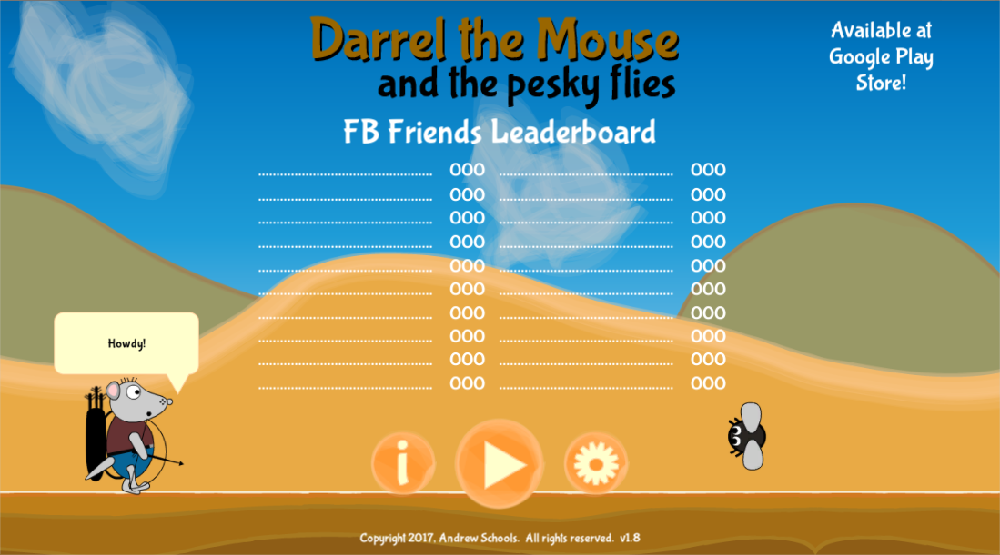

# :mouse: Darrel the Mouse

Darrel the Mouse is a 2D side scroller video game developed in Unity3D 5.6.  It's mobile friendly!  If you would like to collabrate in anyway, let me know.

### Requirements:

* Facebook Unity SDK 7.9.4

### Things still left to do:

* Need to use better audio clips

### Gameplay

### License

Copyright (C) 2017  Andrew Schools

This program is free software: you can redistribute it and/or modify
it under the terms of the GNU General Public License as published by
the Free Software Foundation, either version 3 of the License, or
(at your option) any later version.

This program is distributed in the hope that it will be useful,
but WITHOUT ANY WARRANTY; without even the implied warranty of
MERCHANTABILITY or FITNESS FOR A PARTICULAR PURPOSE.  See the
GNU General Public License for more details.

You should have received a copy of the GNU General Public License
along with this program.  If not, see <http://www.gnu.org/licenses/>.
